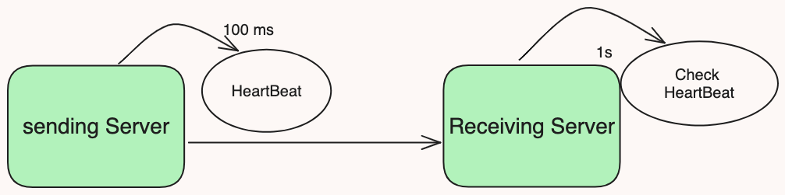

# Heart Beat
A heartbeat mechanism in distributed systems is a periodic signal sent between nodes(machines, servers, or components) to indicate that they are still alive and functioning. This mechanism is crucial for maintaining the health and consistency of the system by allowing nodes to detect failures and take necessary actions, such as failover or reconfiguration.

## Key Concepts
- Heartbeat Messages: Regular signals sent by nodes to indicate their active status.
- Failure Detection: The process of identifying non-responsive nodes.
- Timeout: The time period within which a heartbeat message must be received before assuming a node has failed.
- Recovery Actions: Steps taken when a node failure is detected, such as promoting a follower to a leader.

### This mechanism allows the distributed system to:

- **Detect failures:** By identifying nodes that haven't sent heartbeats, the system can take corrective actions, such as redistributing workloads or initiating failover procedures.
- **Maintain availability:** By quickly detecting failures, the system can minimize downtime and ensure services remain available to users.
- **Improve fault tolerance:** Heartbeats enable the system to adapt to failures and keep functioning even if some nodes go down.

## Architecture


## Problems Addressed by Heartbeat Mechanism
- Node Failure Detection: Quickly detects and isolates failing nodes to maintain system stability.
- Resource Management: Ensures that resources are reallocated efficiently in case of node failure.
- System Health Monitoring: Continuously monitors the health of the system.

## Use cases of Heartbeat Mechanism
- Cluster Management: Used in distributed databases and cluster management systems to monitor node health.
- Microservices Architecture: Ensures that all microservices are running and healthy.
- IoT Networks: Monitors the health of devices in an Internet of Things (IoT) network.
- Real-Time Systems: Ensures continuous operation in real-time systems like financial trading platforms.

## Getting started

```
func main() {
    heartbeatManager := NewHeartbeatManager(5*time.Second, 2*time.Second)
    heartbeatManager.AddNode("node1", "localhost:9001")
    heartbeatManager.AddNode("node2", "localhost:9002")

    go heartbeatManager.StartHeartbeatListener(":9000")
    go heartbeatManager.StartMonitoring()

    // Simulate heartbeat signals
    go func() {
        for {
            conn, _ := net.Dial("tcp", "localhost:9000")
            fmt.Fprintf(conn, "node1\n")
            conn.Close()
            time.Sleep(1 * time.Second)
        }
    }()

    // Keep the main routine running
    select {}
}
```