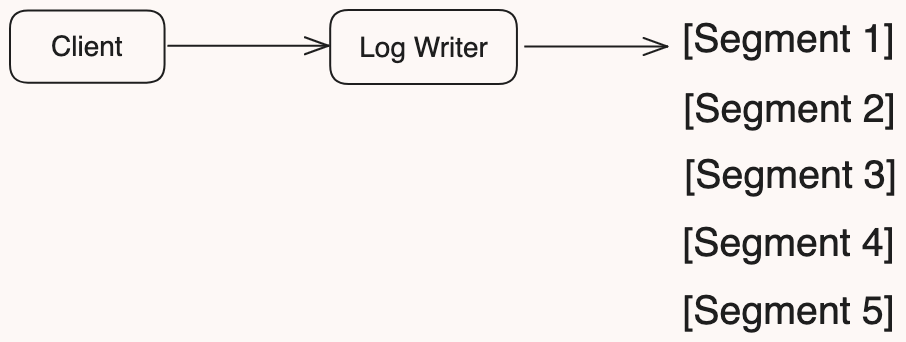

# Segmented Log

A segmented log is a technique used in distributed systems to manage logs by dividing them into multiple smaller, more manageable segments. This approach is often used in systems that require logging for replication, recovery, and consistency purposes. Each segment is a contiguous block of log entries, and the log is effectively a series of these segments.

### Key Concepts
- **Log Segments:** Each segment contains a subset of the total log entries. Segments can be fixed-size or variable-size, depending on the implementation.
- **Segment Naming and Numbering:** Segments are usually named or numbered sequentially to maintain order.
- **Retention and Compaction:** Older segments can be deleted or compacted to save space. Compaction involves merging entries and removing those that are no longer necessary (e.g., overwritten or deleted entries).
- **Metadata:** Each segment often has associated metadata, including the range of log entries it contains, its size, and status.

## Example Use Cases:
- Distributed Databases: Systems like Apache Kafka use segmented logs to manage message logs efficiently.
- Consensus Algorithms: Paxos and Raft implementations often use segmented logs to manage state changes and ensure consistency.
- Event Sourcing: Applications using event sourcing can benefit from segmented logs for managing event histories.
- Logging Systems: Systems that require high-throughput logging can use segmented logs to handle large volumes of log data.

## Problems Addressed by Segmented Log:
- Scalability: By breaking the log into segments, the system can handle larger logs more efficiently.
- Performance: Writing to smaller, fixed-size segments can be more efficient than writing to a single, ever-growing log file.
- Recovery: In case of a crash, only the active segment needs to be checked for consistency, making recovery faster.
- Storage Management: Old segments can be deleted or compacted, reducing storage requirements.

## Solution Provided:
- Efficient Log Management: Allows for efficient appending, reading, and compaction of log entries.
- Improved Performance: Fixed-size segments can be managed more efficiently by the file system.
- Simplified Recovery: Recovery processes only need to focus on the most recent segments, making crash recovery faster.
- Space Optimization: Compaction and deletion of old segments help in optimizing storage usage.
--------------------------
Segmented logs provide an efficient way to manage logs in distributed systems, ensuring scalability, performance, and easier recovery. By dividing logs into manageable segments, systems can handle large volumes of log data more effectively, optimize storage, and maintain high performance.