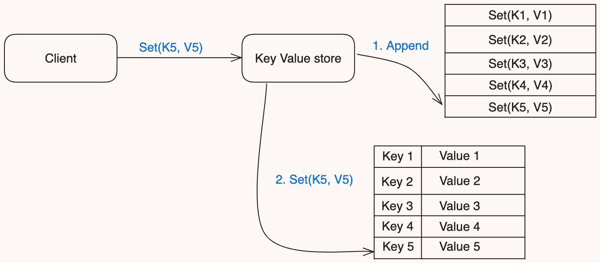

# Write-Ahead Log or (WAL)

The Write-Ahead Log (WAL) is a logging mechanism used in databases and distributed systems to ensure data integrity and durability. The primary idea behind WAL is that all changes to the data are first recorded in a log before being applied to the actual database. This ensures that if a system failure occurs, the log can be used to recover the database to a consistent state.
“Also known as: Commit Log”

## Architecture of Write-Ahead Log (WAL) || How It Works

The diagram provided shows a client interacting with a KVStore, which uses a Write-Ahead Log (WAL) to ensure data durability and consistency. Here’s how we can simplify and explain this architecture:

- **Client:** The client application that sends data operations (e.g., Set(K5, V5)) to the KVStore.
- **KVStore:** The key-value store that handles data operations.
- **Write-Ahead Log:** A log file where all operations are first appended before applying them to the KVStore.

## Example Architecture with WAL
1. Client Application: Issues transactions (insert, update, delete) to the database.
2. Database Engine: Receives transactions and writes changes to the WAL.
3. Log Buffer: Temporarily holds the log entries before flushing them to the log file on disk.
4. Log File: Stores the sequential log entries on disk.
5. Data Store: The actual database where the changes are eventually applied.
6. Checkpoint Process: Periodically writes the state of the database to disk and records the checkpoint in the log.
7. Recovery Process: Uses the WAL to recover the database to a consistent state after a crash by replaying or undoing log entries.
8. File Systems: Some file systems, such as ext4, use journaling techniques similar to WAL to maintain file system integrity.
9. Transactional Systems: Any system that requires strong durability and consistency guarantees, such as financial transaction systems, can benefit from WAL.

### Problem Addressed by WAL
- Data Durability: Ensures that once a transaction is committed, it will not be lost even if the system crashes.
- Atomicity: Guarantees that all parts of a transaction are applied or none at all, maintaining the database's atomicity.
- Consistency: Helps in maintaining a consistent state of the database by ensuring that only valid data modifications are applied.
- Crash Recovery: Facilitates quick recovery from crashes by replaying the log entries.
### Solution Provided by WAL
- Logging Before Applying: All changes are logged before they are applied to the database, ensuring that any incomplete transactions can be rolled back.
- Sequential Writes: Since log files are written sequentially, WAL provides high performance for write-heavy workloads.
- Efficient Recovery: By replaying the log entries, the system can quickly restore the database to its last consistent state after a crash.
- Transaction Isolation: WAL can help in maintaining isolation between transactions, ensuring that intermediate states are not exposed to other transactions.